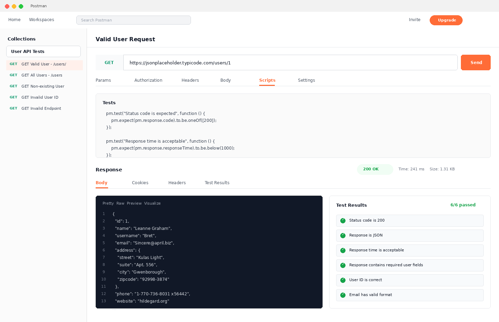
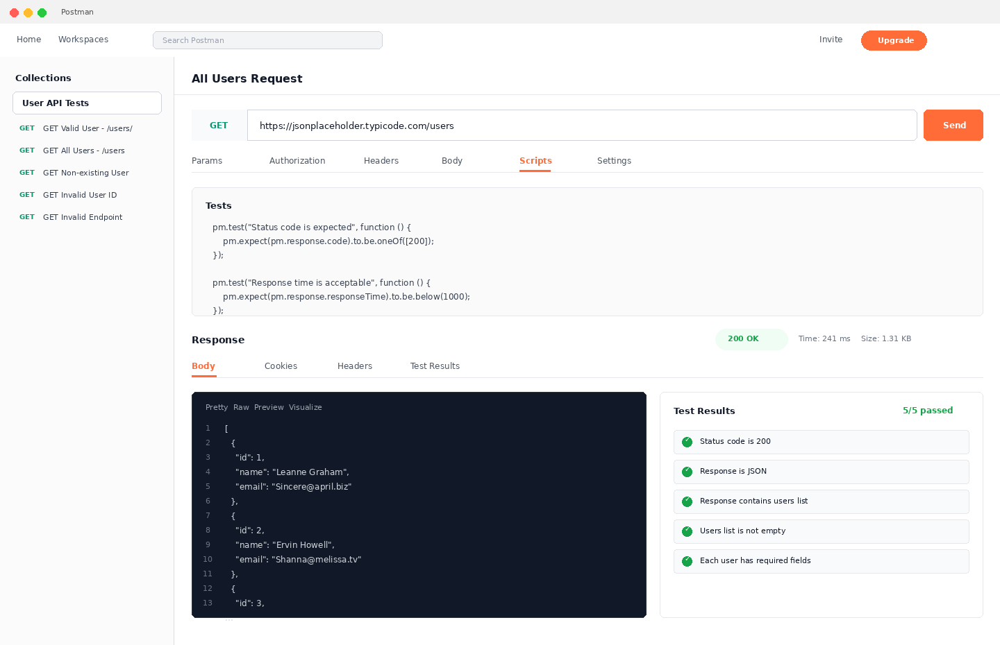
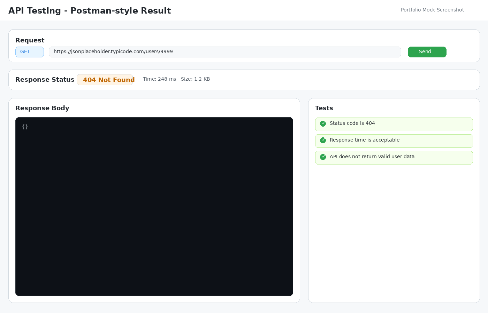
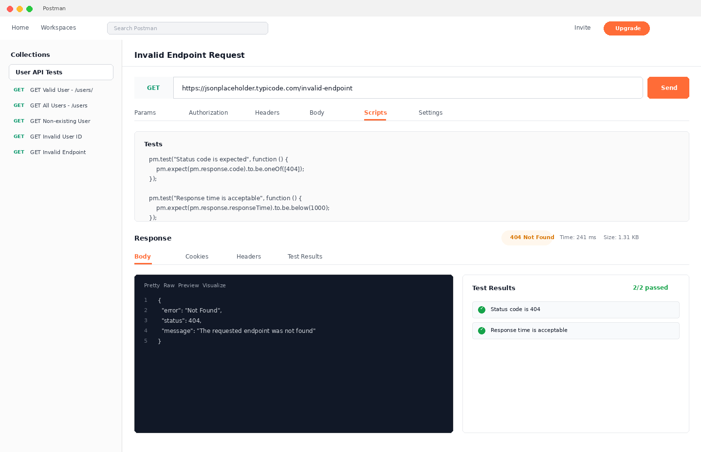
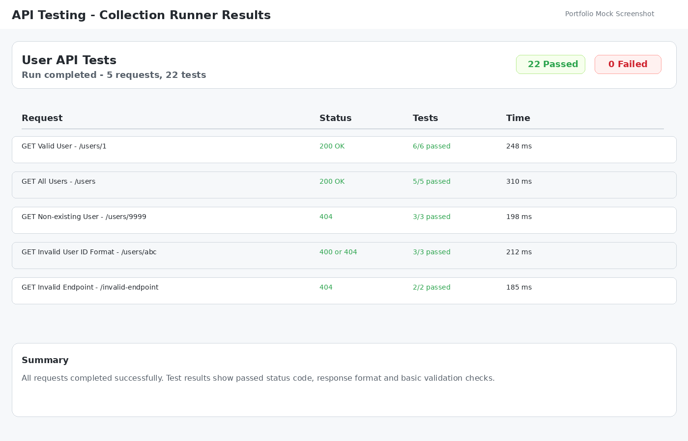

# API Testing Screenshots

This document contains screenshots from Postman API testing.

The screenshots show successful requests, negative scenarios and collection runner results.

---

## 1. Valid User Request

**Endpoint:**  
`GET /users/1`

**Expected Result:**

- Status code is `200 OK`
- Response is returned in JSON format
- User data is returned successfully
- Postman tests are passed

---

## 2. Get All Users Request

**Endpoint:**  
`GET /users`

**Expected Result:**

- Status code is `200 OK`
- Response contains a list of users
- Response is returned in JSON format
- Postman tests are passed

---

## 3. Non-existing User Request

**Endpoint:**  
`GET /users/9999`

**Expected Result:**

- API returns an appropriate error response
- Valid user data is not returned
- Error handling behavior is validated

---

## 4. Invalid Endpoint Request

**Endpoint:**  
`GET /invalid-endpoint`

**Expected Result:**

- Status code is `404 Not Found`
- API does not return valid user data
- Invalid endpoint is handled correctly

---

## 5. Collection Runner Results

This screenshot shows the result of running the full Postman collection.

**Expected Result:**

- Collection runs successfully
- Test results are visible
- Passed and failed tests can be reviewed

---

## Notes

These screenshots are included to demonstrate practical API testing work in Postman.

They show request execution, response validation and test result verification.
